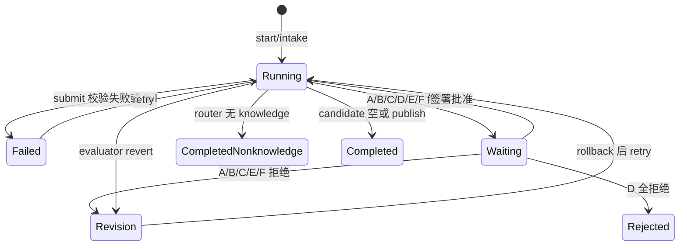

# 阶段、状态与 Gate

**Runtime Source of Truth**：`src/workflow.js:STAGES,DEPENDS,GATES,gateNeeded,preconditions,submit,recordDecision,resume`；数据形状由 `schemas/workflow-state.schema.json` 与 `schemas/workflow-artifacts.schema.json` 控制。文档 `架构与阶段契约.md` 是说明，不能替代代码。

| 阶段 | 输入→输出 | 程序完成条件和下一步 | 提示词来源 |
|---|---|---|---|
| intake | UTF-8 bytes/标注→RAW ID、摘要、字节数 | `start` 自动提交；router 前置 completed | orchestrator/router |
| router | RAW→八类 assets+risk_flags | 锚点确在 RAW、非空白字符全覆盖；风险或 unorganized→Gate A；无知识可终止 | knowledge-router |
| atomicizer | knowledge assets→atoms | 每个知识资产一 atom，原句/锚点一致 | knowledge-atomicizer |
| claims | atoms→claims | 每 atom 一 Claim、原句/锚点一致 | knowledge-atomicizer |
| family_builder | claims→families | 每 Claim 恰一 Family | knowledge-family-builder |
| theme_builder | families→themes+major_change | Family 全覆盖、主题有问题/纳入/排除；重大变化→Gate B | knowledge-theme-builder |
| reconciler | Theme+Claim→relations+version_judgement | 端点有效、冲突/撤回理由；这些或版本判断→Gate C | knowledge-reconciler |
| distiller | Theme/Family/Claim→distillations | 每 Theme 一项，Claim 属对应 Theme | knowledge-distiller |
| proposal | distillations→proposals | 至少一条，链接覆盖蒸馏；必 Gate D | knowledge-distiller |
| canonical | 批准 Proposal→canonical_versions | 只能 `applyApprovedProposals`；正式版本只新增 | 无专门 Skill，受保护服务 |
| skill_candidate | Canonical→candidates | Canonical/Claim 来源+三重验证、晋级、RIA；非空→Gate E，空→completed | knowledge-skill-builder |
| skill_builder | candidates→drafts | 每 draft 绑 candidate；无正式安装 | knowledge-skill-builder |
| evaluator | drafts+登记输出→evaluations | baseline/paired 输出可核，票数/ID/断言；keep→Gate F，revert→退回草稿 | knowledge-evaluator |
| skill_publish | 批准 evaluator→formal_skills | 只能 `publishApprovedSkill`；completed | 无专门 Skill，受保护服务 |

状态：run=`running/waiting_user_approval/completed/completed_nonknowledge/rejected/failed/needs_revision`；stage=`not_started/completed/waiting_review/failed/needs_revision/stale/not_applicable`；checkpoint=`waiting_user_approval/approved/rejected`。状态保存在 `--store/workflows/<wf_id>/RUN_STATE.json`，每次保存也追加 `state-history/*.json` 和 `AUDIT.jsonl`。新会话持有 store、run_id、**若有历史审批则同一 reviewerSecret**，可 `resume`；没有密钥时 `loadState` 对既有签署决定验证失败。用户中途改变已完成阶段内容须人工 rollback+retry；RAW/正式 Canonical/Skill 不破坏性回滚，新语义变动需要修订提案。直接跳阶段由 `preconditions` 硬拦；错误分类、未标风险、假的评测独立性不由程序拦。

**硬机制**：Ajv/引用/覆盖、前置 completed、Gate checkpoint、签名、版本指纹、服务 actor、CLI TTY/密钥。**软机制**：Skill 触发/局部加载、语义拆件/同主张归并、重要冲突识别、真实任务预注册、judge 独立性、用户身份、外部模型调度。CLI TTY 是操作界面门槛，不是 OS 权限隔离。
