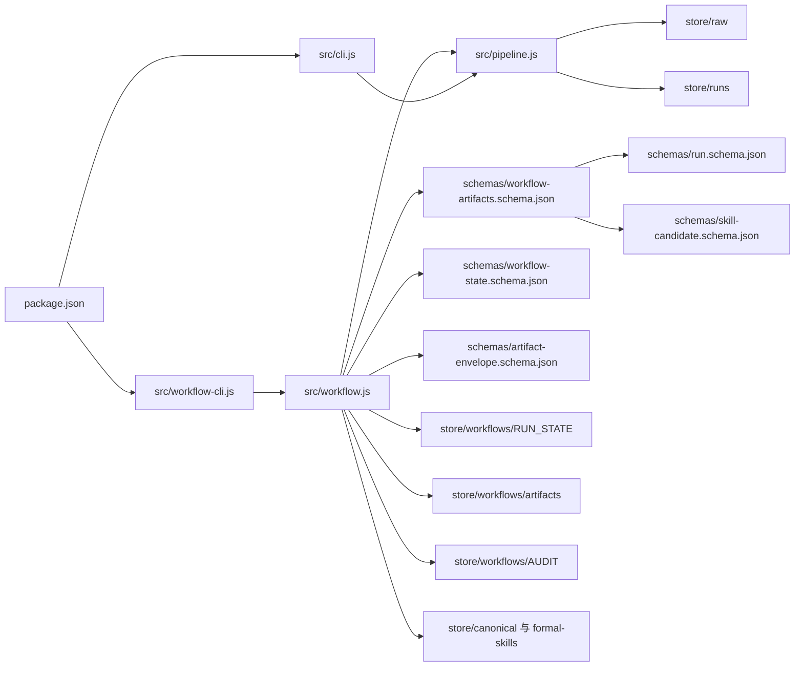
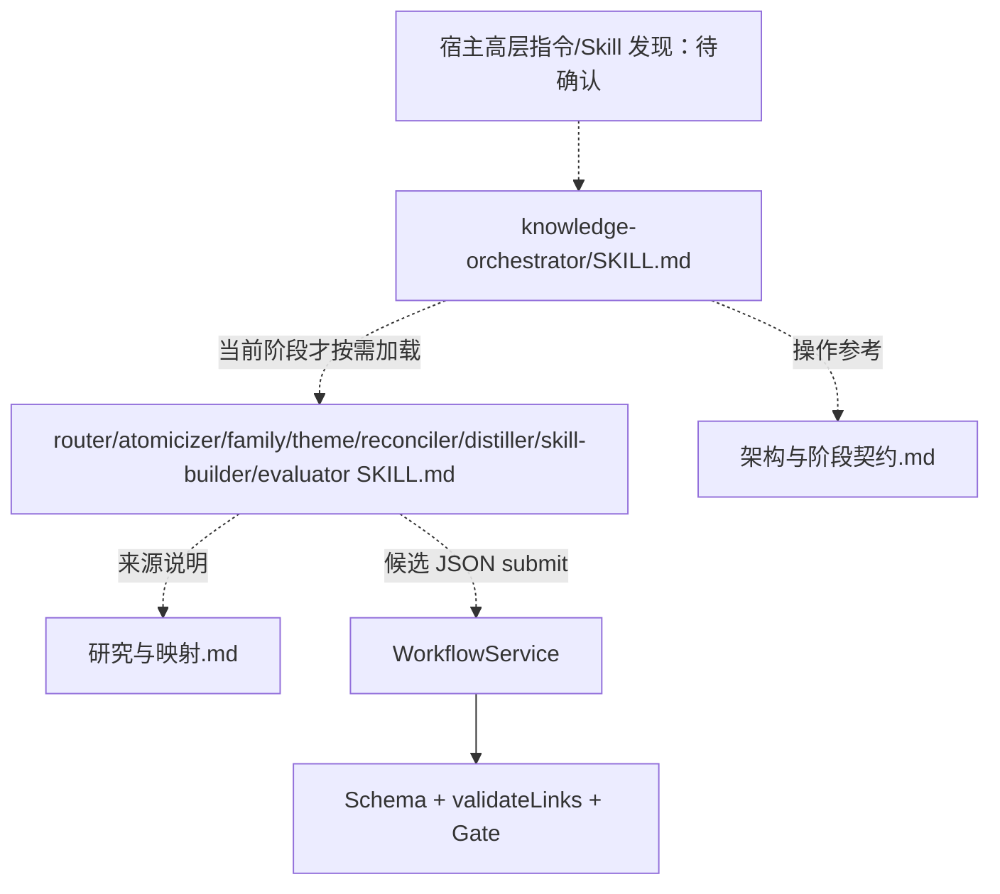
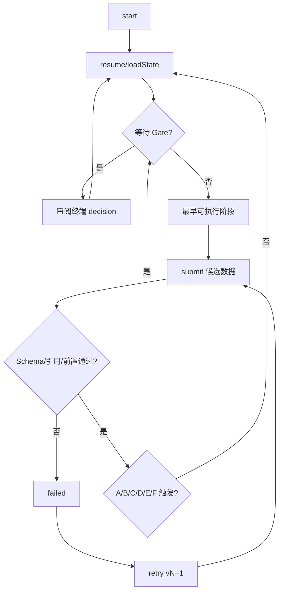

# 依赖与调用地图

图中实线表示源码 import/读文件/调用；虚线文字表示 Agent 指令要求的动作，仓库内无自动 Skill loader。Schema 的 $ref 也是程序实际解析依赖。`DEPENDS` 将每个阶段绑到前一阶段 Artifact，而 `validateLinks` 还跨阶段读取 router/claims/Theme/Family。

```mermaid
flowchart LR
  Input[TXT bytes + annotations] --> RAW[raw_id + RAW/元数据]
  RAW --> Suggestion[runs/run_*.json 旧建议]
  RAW --> Intake[intake Artifact]
  Intake --> Router[router assets]
  Router --> Atom[atoms] --> Claim[claims] --> Family[families] --> Theme[themes]
  Theme --> Relation[relations] --> Distill[distillations] --> Proposal[proposals]
  Proposal --> Approval[签署逐项决定] --> Canon[canonical_versions]
  Canon --> Candidate[candidates] --> Draft[drafts] --> Output[evaluation-outputs]
  Output --> Eval[evaluations] --> PubApproval[签署发布决定] --> Publish[formal-skills 记录]
```

引用证据：`src/workflow.js` import、`STAGES/DEPENDS`、`validateLinks`、`gateNeeded`、`loadState`；`src/workflow-cli.js` action switch；`schemas/workflow-artifacts.schema.json` 的 $ref；`skills/knowledge-orchestrator/SKILL.md` 的局部加载指令。四份参考仓库只由 `研究与映射.md` 链接，当前程序无调用边。
